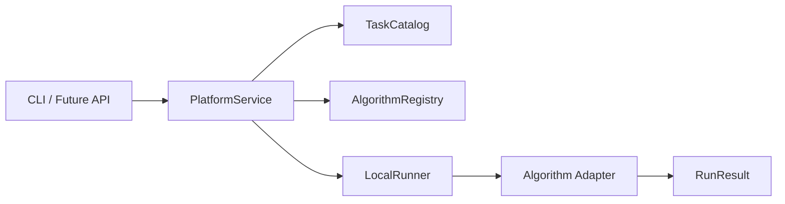
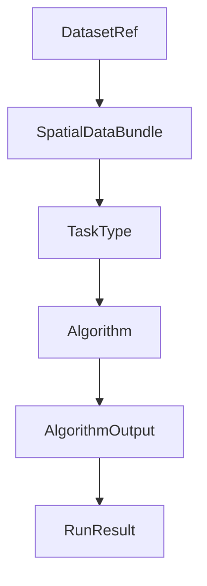

# 架构说明

## 设计目标

本架构专注于构建统一的平台底座，核心解决四个问题：

1. 统一数据描述
2. 统一任务描述
3. 统一算法描述
4. 统一执行结果描述

## 核心模块

### `data`

负责描述数据对象，不直接绑定某个具体分析框架。当前通过 `SpatialDataBundle` 表达一个数据集的基础信息、资产清单和元数据，后续可以向 `AnnData` / `SpatialData` 适配。

### `tasks`

负责描述平台支持的任务类型和任务目录，例如 `QC`、`空间域检测`、`解卷积`。

### `algorithms`

负责描述算法规范和实现。算法通过统一的 `Algorithm` 抽象接入，并带有 `AlgorithmSpec` 元信息。

### `core`

负责平台公共能力：

- `TaskCatalog`
- `AlgorithmRegistry`
- `LocalRunner`

### `workflows`

负责把目录、注册表和 runner 组装成一个对外可调用的服务层。

## 当前执行流

## 当前数据流

## 扩展路线

### 第一步：真实数据适配

- 新增 `io` / `adapters` 模块
- 增加 `Visium` 读取器
- 增加 `AnnData` / `SpatialData` 适配器

### 第二步：真实算法接入

- 每个算法一个 adapter
- 参数标准化
- 错误与日志标准化

### 第三步：执行环境隔离

- 把 `LocalRunner` 扩展为 `SubprocessRunner`
- 再扩展为 `ContainerRunner`
- 为 R 生态算法预留跨环境执行能力

### 第四步：前后端接入

- `PlatformService` 之上加 API
- API 之上再做最小 Web UI

## 设计边界

当前版本是可演进的底座，尚未包含以下生产级特性：

- 数据库
- 消息队列
- 容器编排
- 多用户鉴权
- 重型可视化前端

这些能力将在底座稳定后逐步引入。
